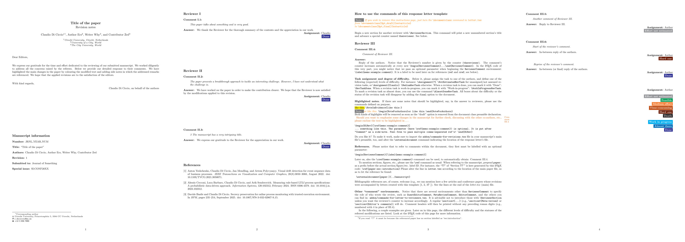

# letter-2-reviewers-LaTeX-template
A LaTeX template to write response letters for journal and conference paper revisions. It comes bundled with commands that add sidenotes to the paper referencing the comments they address. Please find detailed usage instructions directly in the [`letter.pdf`](letter.pdf) file (page 3).

Kudos to [apwbs](https://github.com/apwbs/), [ValerioGoretti](https://github.com/ValerioGoretti/), and [dave0909](https://github.com/dave0909/) for the fine tuning and support. If you want to share your experience with this template, feel free to do so (e.g., via LinkedIn [linkedin.com/in/claudiodiciccio](https://www.linkedin.com/in/claudiodiciccio/)).  For any questions or comments, drop me a line at [claudio@diciccio.net](mailto:claudio@diciccio.net)!

This template has been used in the course of the revision rounds of a number of publications, including the ones below. It goes without saying, the list is biased by the author’s personal experience. 

* [Secrecy Preservation for Online Process Monitoring with Trusted Execution Environment](https://doi.org/10.1007/978-3-032-02867-9_15) (Proc. of BPM, 2025)
* [Measuring rule-based LTLf process specifications: A probabilistic data-driven approach](https://doi.org/10.1016/j.is.2023.102312) (Information Systems, 2024)
* [Tiramisù: making sense of multi-faceted process information through time and space](http://dx.doi.org/10.1007/s10844-024-00875-8) (Journal of Intelligent Information Systems, 2024)
* [Event-case correlation for process mining using probabilistic optimization](http://dx.doi.org/10.1016/j.is.2023.102167) (Information Systems, 2023)
* [Measuring the interestingness of temporal logic behavioral specifications in process mining](http://dx.doi.org/10.1016/j.is.2021.101920) (Information Systems, 2022)
* [On the adoption of blockchain for business process monitoring](http://dx.doi.org/10.1007/s10270-021-00959-x) (Software & Systems Modeling, 2022)
* [Visual Drift Detection for Event Sequence Data of Business Processes](http://dx.doi.org/10.1109/TVCG.2021.3050071) (IEEE Transactions on Visualization and Computer Graphics, 2021)
* [Conformance checking of mixed-paradigm process models](https://doi.org/10.1016/j.is.2020.101685) (Information Systems, 2020)
* [On the Relevance of a Business Constraint to an Event Log](https://doi.org/10.1016/j.is.2018.01.011) (Information Systems, 2018)
* [Matching Events and Activities by Integrating Behavioral Aspects and Label Analysis](https://doi.org/10.1007/s10270-017-0603-z) (Software & Systems Modeling, 2018)
* [Parallel algorithms for the automated discovery of declarative process models](https://doi.org/10.1016/j.is.2017.12.002) (Information Systems, 2018)
* [Resolving inconsistencies and redundancies in declarative process models](http://dx.doi.org/10.1016/j.is.2016.09.005) (Information Systems, 2017)
* [Detecting flight trajectory anomalies and predicting diversions in freight transportation](http://dx.doi.org/10.1016/j.dss.2016.05.004) (Decision Support Systems, 2016)
* [Efficient discovery of Target-Branched Declare constraints](https://doi.org/10.1016/j.is.2015.06.009) (Information Systems, 2016)

